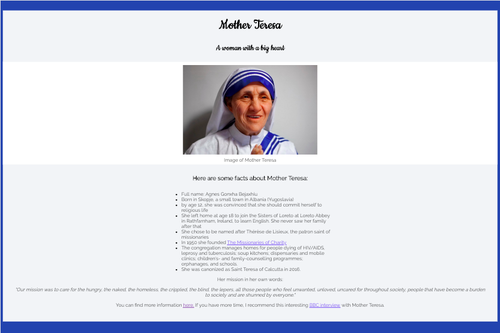

## Project Tribute-Page

This is the first project for the certificate "Responsive Web Design" of the FreeCodeCamp.
The goal of the project is to learn how to use HTML, CSS and Responsive Design.

## How to run the application?

Download the files and save them in a folder. Then open the index.html file in a browser.

## Built with

The project was built with the following languages and resources:

- HTML
- CSS
- Google Fonts
